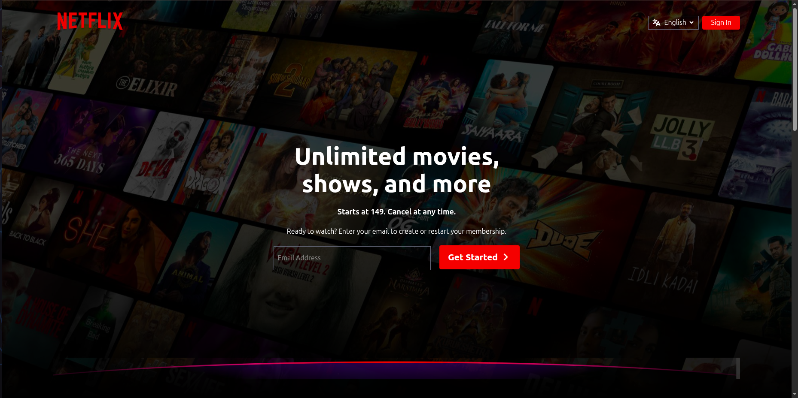

# 🛒 ShopeEase | Ecommerce Web App - [(Link)](https://shope-ease-nu.vercel.app/)

This is a Netflix Clone application built using **React.js**, **Tailwind CSS**, **Context Api** to replicate the user interface and functionality of Netflix.



## 📖 Table of Contents
- [Introduction](#-introduction)
- [Features](#-features)
- [Tech Stack](#-tech-stack)
- [Installation](#️-installation)
- [API](#-api)
- [Screenshots](#screenshots)
- [License](#-license)

## 📝 Introduction
ShopeEase is Modern, Responsive online Ecommerce store where users can browse, search products(Clothes, Electronics, Furniture) and manage a shopping cart.

## ✨ Features
- Movie/TV Shows Browsing
- Interactive UI
- Search Movies (By title)
- Add Movies to WatchList
- LocalStorage to Store the credentials
- Global Store(Context Api)
- Real-Time Data: Fetches data from the [TMDb API](https://www.themoviedb.org/documentation/api).


## 🧰 Tech Stack
- [React.js](https://react.dev/learn)
- [Material UI (MUI)](https://mui.com/)
- [Tailwind CSS](https://tailwindcss.com/)
- [Context Api](https://legacy.reactjs.org/docs/context.html)
- [react-intersection-observer (Library)](https://www.npmjs.com/package/react-intersection-observer)
- [Vanilla CSS](https://developer.mozilla.org/en-US/docs/Web/CSS)

## ⚙️ Installation

```
git clone git@github.com:patilOm1680/Netflix.git
```
```
cd Netflix
```

```
npm install
```

```
npm run dev
```


## 🔌 API

### Setup Environment Variables

1. Create a `.env` file in the root directory of the project.
2. Add the following environment variables to the `.env` file:

```bash
# Base URL for images
VITE_ImageBaseUrl=https://image.tmdb.org/t/p/w500/

# TMDb API Key (Get your own key from https://www.themoviedb.org/)
VITE_ApiKey=your_api_key_here

# API Endpoints for Movies
VITE_PopularMovies=https://api.themoviedb.org/3/movie/popular
VITE_TrendingMovies=https://api.themoviedb.org/3/trending/movie/day
VITE_TopRatedMovies=https://api.themoviedb.org/3/movie/top_rated
VITE_UpcomingMovies=https://api.themoviedb.org/3/movie/upcoming

# API Endpoints for TV Shows
VITE_PopularShows=https://api.themoviedb.org/3/tv/popular
VITE_TopRatedShows=https://api.themoviedb.org/3/tv/top_rated
VITE_TrendingShows=https://api.themoviedb.org/3/trending/tv/day
VITE_UpcomingShows=https://api.themoviedb.org/3/tv/on_the_air

# Genre list for movies
VITE_Genre=https://api.themoviedb.org/3/genre/movie/list

# YouTube Video Embed Links for Movie/Show Trailers
VITE_MovieYt=https://www.youtube.com/embed/x--N03NO130?autoplay=1&mute=1&loop=1&playlist=x--N03NO130&controls=0&showinfo=0&rel=0&modestbranding=1&playsinline=1&enablejsapi=1&disablekb=1&iv_load_policy=3
VITE_TVShowYt=https://www.youtube.com/embed/cQ_XfnO2EhU?autoplay=1&mute=1&loop=1&playlist=cQ_XfnO2EhU&controls=0&showinfo=0&rel=0&modestbranding=1&playsinline=1&enablejsapi=1&disablekb=1&iv_load_policy=3

# Search Movies
VITE_SearchUrl=https://api.themoviedb.org/3/search/movie
```

## Screenshots


## 📄 License
No license right now.
